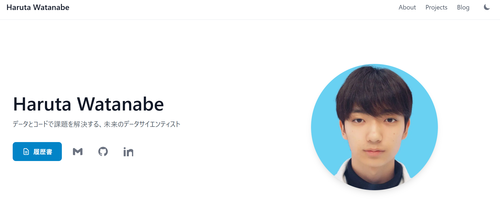

# Haruta Watanabe's Portfolio Website



こちらは渡邉 朝太（Haruta Watanabe）のポートフォリオサイトのソースコードです。
This is the source code for the portfolio website of Haruta Watanabe.

**Live URL:** [https://harutawatanabe.com](https://harutawatanabe.com)

---

## 🚀 コンセプト / Concept

このサイトは、私のスキル、プロジェクト経験、そして私自身について知ってもらうためのオンライン上の名刺です。シンプルで見やすく、私の技術的な強みが伝わるように設計しました。

This site serves as my online business card, designed to introduce my skills, project experience, and a little about myself. It is designed to be simple, easy to read, and to clearly convey my technical strengths.

---

## 🛠️ 使用技術 / Tech Stack

| カテゴリ (Category)         | 技術 (Technology)                 |
| :------------------------- | --------------------------------  |
| フレームワーク (Framework)  | Astro                             |
| スタイリング (Styling)      | Tailwind CSS                      |
| 言語 (Languages)           | TypeScript, HTML, CSS, JavaScript  |
| デプロイ (Deployment)       | GitHub Pages                      |

---

## ✨ 主な機能 / Features

- **多言語対応 (Multi-language Support):** `Accept-Language` ヘッダーに基づき、日本語/英語を自動で切り替え。
  - Automatically switches between Japanese and English based on the `Accept-Language` header.
- **レスポンシブデザイン (Responsive Design):** PC、タブレット、スマートフォンなど、あらゆるデバイスで最適に表示。
  - Optimized for display on all devices, including PCs, tablets, and smartphones.
- **プロジェクト紹介 (Project Showcase):** これまで手掛けたプロジェクトをカード形式で表示。
  - Displays past projects in a card-based format.
- **スキルセット表示 (Skills Display):** 私が使用できる技術を一覧で紹介。
  - Lists the technologies I am proficient with.

---

## 📖 セットアップとローカル開発 / Setup and Local Development

このプロジェクトをあなたのローカル環境で動かすには、以下の手順に従ってください。
To run this project in your local environment, follow the steps below.

1.  **リポジトリをクローン (Clone the repository):**

    ```bash
    git clone [https://github.com/haruta-watanabe/portfolio.git](https://github.com/haruta-watanabe/portfolio.git)
    cd portfolio
    ```

2.  **依存関係をインストール (Install dependencies):**

    ```bash
    npm install
    # or yarn install, pnpm install
    ```

3.  **開発サーバーを起動 (Start the development server):**
    ```bash
    npm run dev
    ```
    ブラウザで `http://localhost:4321` を開いてください。
    Open `http://localhost:4321` in your browser.

---

## ©️ ライセンス / License

このウェブサイトのソースコードは、[MIT ライセンス](LICENSE)のもとで公開されています。ライセンスの全文は `LICENSE` ファイルをご覧ください。

**ただし、リポジトリに含まれる以下のコンテンツは MIT ライセンスの対象外であり、すべての権利は作者である Haruta Watanabe が保有します。**

- プロフィール写真を含む、すべての画像ファイル
- プロジェクトの紹介文やブログ、自己紹介などのテキストコンテンツ

---

The source code of this website is licensed under the [MIT License](LICENSE). See the `LICENSE` file for the full license text.

**However, the content included in this repository is NOT subject to the MIT License, and all rights are reserved by the author, Haruta Watanabe. This includes:**

- All image files, including the profile photo.
- All text content, such as project descriptions, blogs and the "About Me" section.
